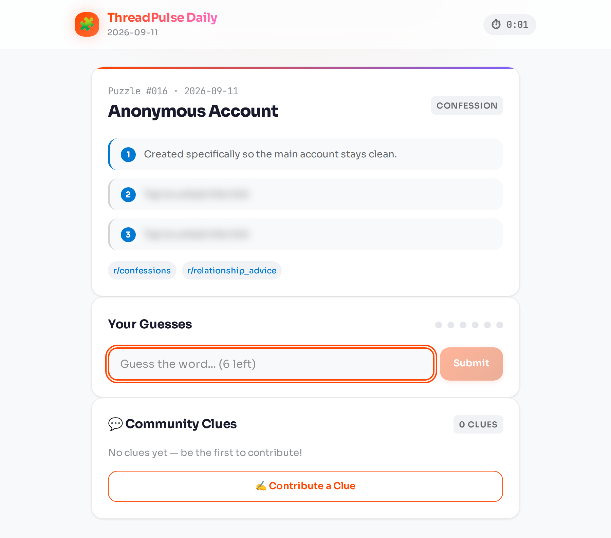
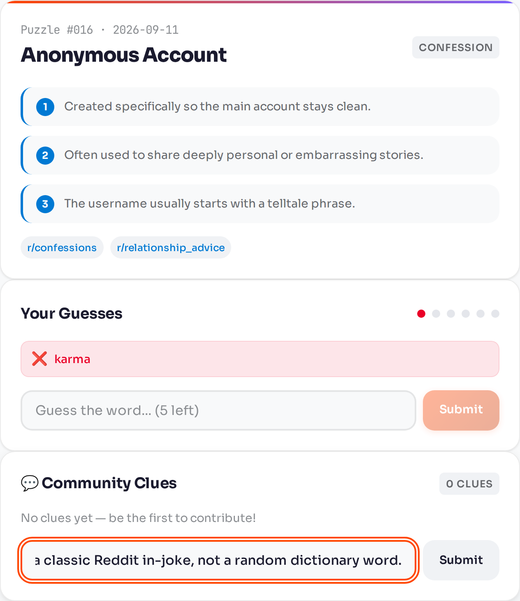
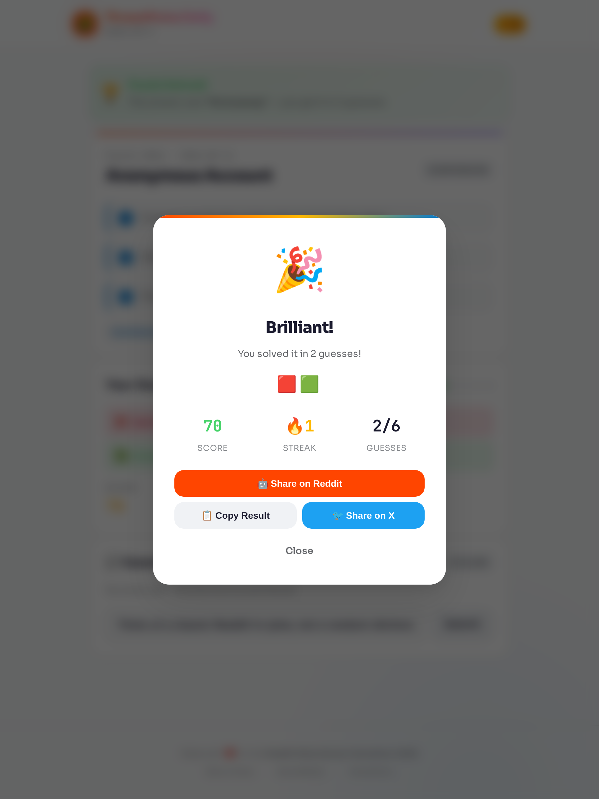
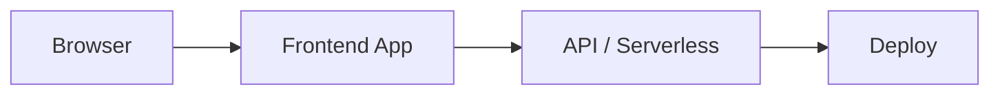

# ThreadPulse Daily

A **Wordle-style daily word puzzle** for Reddit: guess a Reddit-themed word, unlock progressive hints, share your score, and leave community clues for the next player.

> Reddit Daily Games Hackathon 2026 · Play → Guess → Share → Community Clues → Repeat.

## Product screenshots

Live UI captured from a local production preview (`npm run build && npm run preview`) of the running game.

**Home / daily puzzle** — today's card, the free first hint, remaining locked hints, guess input, and the community-clues panel.



**Hints, guesses, and community clues** — unlocked progressive hints, a recorded wrong guess, and the clue composer.



**Result modal** — score, streak, emoji grid, and share to Reddit / clipboard / X after a solve.



---

### Project links
- **Video Demo:** [Watch the Demo on GitHub](https://github.com/mangeshraut712/ThreadPulse-Daily/blob/main/apps/devvit/assets/Demo.mov?raw=true)
- **Live Demo (Reddit):** [r/ThreadPulse2026](https://www.reddit.com/r/ThreadPulse2026)
- **Source Code:** [GitHub Repository](https://github.com/mangeshraut712/ThreadPulse-Daily)
- **Developer Portal:** [Reddit Apps Dashboard](https://developers.reddit.com/apps/threadpulsedaily)

---

## What is ThreadPulse Daily?

Each day brings a new puzzle drawn from Reddit culture, memes, community inside jokes, and platform mechanics. The same date-seeded puzzle is served to every player at midnight UTC.

### How to Play

1. **Start the daily puzzle** — A new puzzle appears every day at midnight UTC, seeded by date so every player gets the same challenge
2. **Read the first hint** — The first hint is always free and gives you a starting point
3. **Make your guess** — Type your answer and submit (you have 6 attempts)
4. **Unlock more hints** — Stuck? Tap locked hints to reveal them (each hint costs 15 points)
5. **Check community clues** — Read clues submitted by other players, or contribute your own
6. **Share your result** — Share your Wordle-style emoji grid on Reddit, X, or copy to clipboard

### Scoring

| Factor | Effect |
|---|---|
| Base score | 100 points |
| Hint penalty | −15 per hint (after the first) |
| Time penalty | −1 per 6 seconds (max −35) |
| Streak bonus | +1 per 2 streak days (max +25) |
| Minimum score | 5 points |

**Range:** 5 – 125 points per puzzle.

---

## Hackathon alignment

| Criterion | How ThreadPulse Delivers |
|---|---|
| **Delightful UX** | Glassmorphism cards, animated hints, confetti on solve, result sharing modal, live timer, streak fire badge, smooth transitions |
| **Polish** | Zero TypeScript errors, responsive design, accessibility (focus rings, ARIA labels, reduced motion), dark mode, PWA with offline support |
| **Reddit-y** | Every puzzle references Reddit culture (karma, rickroll, hivemind, etc.), subreddit tags, "Share on Reddit" button, community clue voting with Reddit-style arrows |
| **Recurring Content** | 35+ unique puzzles with date-seeded daily selection, streak tracking, community-generated clues refresh daily |
| **GameMaker** | CSS animation layer with GameMaker-compatible hooks: celebration, success, error, hint-reveal, guess-submit effects |

---

## Features

### Core Gameplay
- **Daily puzzle** — Date-seeded, same puzzle for everyone each day (UTC midnight)
- **6 guesses** — Visual dot indicators show remaining attempts
- **3 progressive hints** — Tap locked hints to reveal (costs 15 score points each)
- **Smart deduplication** — Prevents repeated guesses
- **Streak tracking** — Maintain your daily streak for bonus points
- **Leaderboard** — Compete with other players (Redis-backed via Devvit)

### Visual Polish
- Glassmorphism cards with backdrop blur
- Animated gradient bar on puzzle card
- Hint slide-in animations with staggered delays
- Guess tiles with ✅/❌ icons and slide animations
- Confetti particle system on solve (50 particles, 7 colors)
- Result modal with bounce animation and blur backdrop
- Streak fire badge with pulsing glow
- Live timer with monospaced font (JetBrains Mono)

### Community Features
- **Community clues** — Contribute clues for other players
- **Reddit-style voting** — Upvote/downvote arrows on clues
- **Share results** — Emoji grid for Reddit, X, or clipboard
- **Subreddit tags** — Each puzzle tagged with relevant communities
- **Clue validation** — Automatic answer-filtering and length checks
- **Mod boost system** — Moderators can boost high-quality clues

### Mobile Experience
- Touch gesture detection (swipe, tap, long press, pinch)
- Haptic feedback (success, error, warning patterns)
- Responsive layout optimized for 640px breakpoint
- Full-width inputs on mobile
- Apple PWA support with `apple-mobile-web-app-capable`

### Accessibility
- Keyboard navigation with visible focus rings
- ARIA labels on all interactive elements
- Respects `prefers-reduced-motion`
- Enhanced borders for `prefers-contrast: high`
- Dark mode with system-preference auto-detection

---

## 🤝 Reddit Integration

ThreadPulse Daily runs natively on Reddit via the **Devvit** platform:

- **Custom Post Type** — Full-height interactive post embedded in subreddits
- **Webview Integration** — The game runs inside Reddit's webview with message bridge
- **Redis Backend** — Leaderboard scores and community clues stored via Devvit Redis
- **Menu Item** — Moderators create daily posts via subreddit menu → "Create ThreadPulse Daily Post"
- **Seamless Experience** — Players never leave Reddit

---

## 🛠 Tech Stack

| Layer | Technology |
|---|---|
| **Frontend** | React 18 + TypeScript 5.7 (strict mode) |
| **Build** | Vite 6.4 with code splitting and treeshaking |
| **State** | Zustand + localStorage persistence |
| **Styling** | Custom design system (700+ lines CSS, glassmorphism, dark mode) |
| **AI** | TensorFlow.js — adaptive difficulty, personalized hints |
| **Animations** | GameMaker-compatible CSS animation system (zero JS overhead) |
| **Mobile** | Haptic Feedback API, touch gesture detection |
| **PWA** | Installable, offline-capable, service worker |
| **Reddit** | Devvit Public API 0.12.0, Custom Post Type, Redis |
| **Fonts** | Sora (headings) + JetBrains Mono (scores/timer) |

---

## 📊 Puzzle Categories

| Category | Examples |
|---|---|
| Reddit Culture | karma, upvote, cakeday, subreddit |
| Internet Memes | rickroll, copypasta, shitpost |
| Community Behavior | lurker, hivemind, throwaway |
| Platform Mechanics | crosspost, flair, moderation |
| Reddit Traditions | ama, banana-for-scale, gilded |
| Gaming | speedrun |
| Meta | repost, frontpage |

35+ puzzles cover a full month+ of daily content.

---

## 📁 Project Structure

```
threadpulse-daily/
├── src/
│   ├── App.tsx                    # App shell (timer, confetti, result modal)
│   ├── main.tsx                   # Entry point
│   ├── components/
│   │   ├── GameBoard.tsx          # Core game UI
│   │   ├── Confetti.tsx           # Celebration particle effects
│   │   └── ResultModal.tsx        # Share results (Reddit, X, clipboard)
│   ├── core/
│   │   └── dailyGameEngine.ts     # Puzzle selection, scoring, clue validation
│   ├── data/
│   │   └── puzzleBank.ts          # 35+ Reddit-themed puzzles
│   ├── hooks/
│   │   ├── useGameStore.ts        # State management + streak tracking
│   │   ├── useAIAdaptive.ts       # TensorFlow.js AI features
│   │   ├── useGameMaker.ts        # GameMaker animation system
│   │   ├── useHapticFeedback.ts   # Mobile haptic patterns
│   │   └── useMobileGestures.ts   # Touch gesture detection
│   ├── styles/
│   │   └── design-system.css      # Complete design token system
│   ├── types/
│   │   └── index.ts               # TypeScript interfaces
│   └── utils/
│       └── devvitBridge.ts        # Devvit ↔ Webview message bridge
├── apps/devvit/                   # Devvit app (Custom Post Type + Redis)
│   ├── devvit.json                # App config
│   ├── src/main.tsx               # Post type, menu item, Redis handlers
│   └── webroot/                   # Built game (Vite output)
├── packages/
│   ├── wasm/                      # Rust/WASM engine (scoring optimization)
│   └── gamemaker/                 # GameMaker animation layer
├── public/
│   ├── manifest.json              # PWA manifest
│   ├── sw.js                      # Service worker
│   ├── icon-192.png               # PWA icon
│   └── icon-512.png               # PWA icon
└── scripts/                       # QA & verification scripts
```

---

## 🚀 Quick Start

```bash
# Install dependencies
npm install

# Start development server
npm run dev

# Type check
npx tsc --noEmit

# Production build
npm run build

# Build for Devvit deployment
npm run build:devvit

# Run all QA checks
npm run qa
```

---

## 🏗 Architecture Decisions

1. **No external CSS framework** — Custom design tokens for maximum control and performance
2. **Pure CSS animations** — Zero JS animation overhead, GameMaker-compatible
3. **LocalStorage persistence** — Streaks and game state survive page refresh
4. **Date-seeded RNG** — Deterministic puzzle selection via FNV-1a + Mulberry32
5. **Code splitting** — Vite auto-splits vendor, AI, animation, and UI chunks
6. **Type-safe throughout** — Strict TypeScript with no `any` in game logic
7. **Devvit message bridge** — Bidirectional communication between webview and Reddit host
8. **Progressive enhancement** — Core functionality works without AI or WASM

---

## 🧪 Testing

```bash
npm run test           # Self-test suite (39 checks)
npm run simulate       # Game simulation (5 scenarios)
npm run balance        # Game balance verification
npm run check:submission  # Submission package check
npm run verify:final   # Final verification (56 checks)
npm run qa             # Run all of the above
```

---

## 🙏 Acknowledgments

- **Reddit** — For the Devvit platform and this hackathon
- **GameMaker** — For the animation system tools
- **TensorFlow.js** — For AI/ML capabilities
- **The Reddit Community** — For inspiring all the puzzle content

---

## 📄 License

MIT License. Built for the Reddit Daily Games Hackathon 2026.

---

*Made with ❤️ for the Reddit community.*

---

<!-- codex:project-diagram:start -->

## Project Diagram



_High-level flow of the deployed web experience and supporting services._

<!-- codex:project-diagram:end -->
